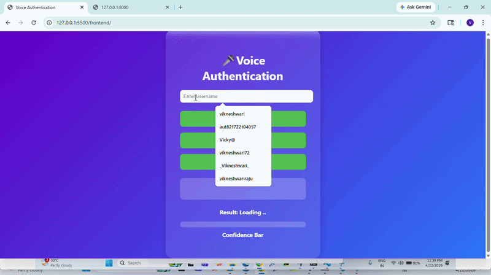

## Voice-Based Authentication System

Live Demo: https://voice-authentication-system.netlify.app/    
Backend API Docs: https://voice-authentication-system.onrender.com/docs

---

## Overview

This project is a full-stack voice biometric authentication system that verifies user identity using speech patterns. It uses MFCC feature extraction and an SVM classifier, integrated with a FastAPI backend and a browser-based frontend.

---

## Demo Video 🎥

<p align="center">
    
</p>

---

## Screenshots 📸

### Preview
<p align="center">

</p>

---

## Features 🚀

* Voice-based user registration and login
* Real-time audio recording via browser
* Machine learning model using Support Vector Machine (SVM)
* MFCC feature extraction using librosa
* FastAPI backend for processing and prediction
* SaaS-style dashboard with authentication results
* Deployed full-stack application

---

## Tech Stack 🧠

### Backend

* Python
* FastAPI
* Scikit-learn (SVM)
* Librosa
* NumPy

### Frontend

* HTML
* CSS
* JavaScript
* Web Audio API

### Deployment 🌐

* Render (Backend)
* Vercel / Netlify (Frontend)

---

## System Workflow

1. User records voice using the browser microphone
2. Audio is sent to the FastAPI backend
3. MFCC features are extracted from the audio
4. The SVM model verifies the user identity
5. The backend returns authentication result with confidence score
6. The frontend dashboard displays the result

---

## API Endpoints

| Method | Endpoint  | Description                 |
| ------ | --------- | --------------------------- |
| POST   | /register | Register user voice         |
| POST   | /login    | Authenticate user via voice |

---

## Sample Response

```json
{
  "status": "success",
  "user": "Vikneshwari",
  "confidence": 0.87
}
```

---

## Project Structure

```
Voice-Based-Authentication/
│
├── backend/
|   |___train_model.py
│   ├── main.py
│   ├── model/
│   └── audio_utils.py
│
├── frontend/
│   ├── index.html
│   ├── dashboard.html
│   └── script.js
│
└── README.md
```

---

## Run Locally ⚙️

### Backend

```
cd backend
pip install -r requirements.txt
uvicorn main:app --reload
```

### Frontend

```
cd frontend
python -m http.server 5500
```

Open in browser:

```
http://localhost:5500
```

---

## Key Learnings

* Audio signal processing using MFCC
* Machine learning model development using SVM
* FastAPI for building REST APIs
* Frontend and backend integration
* Deployment of full-stack applications
* Biometric authentication concepts

---

## Future Improvements

* Noise reduction for improved accuracy
* Deep learning-based voice recognition
* Multi-factor authentication (face and voice)
* Advanced analytics dashboard

---

## Author

Vikneshwari R
GitHub: https://github.com/vikneshwariraju
LinkedIn: https://www.linkedin.com/in/vikneshwariraju/

---

## Notes

For best performance, use a modern browser such as Chrome and allow microphone access.
